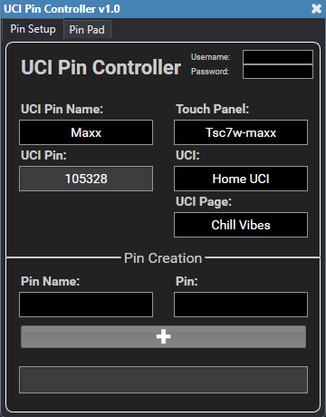
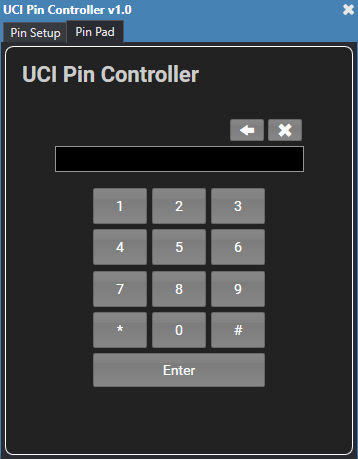

# Q-SYS UCI Pin Controller

This is a Q-SYS plugin that allows you to easily and dynamically assign a pin to a UCI and also provides a pin pad to put on the UCI. It uses the pins that are created in Core Manager but also lets you add new ones.

## How to Use

* Simply download the .qplug file and add it to your C:\Users\user\Documents\QSC\Q-Sys Designer\Plugins folder. 
* Drag into your schematic from the plugins section of your Schematic Elements. 
* If your Core does not have Access Management enabled, then you can leave the username and password fields in the top right corner blank. If you DO have Access Management enabled, the status will let you know that the username and password is required. Enter in your Core's username and password. This is so that you can get and create pins.
* Once you are "connected" (you have entered the username and password IF your Core has Access Management enabled), select a UCI Pin Name (these are retrieved from the pins created in Core Manager). Once you do so, the corresponding pin will show up in the UCI Pin field.
* Select a touch panel (these are all of the touch panels or UCI Viewers in your design). This will be the touch panel that you are assigning the pin to. 
* Then select a UCI (these are all of the UCIs in your design). Once a UCI is selected, the UCI Page drop-down will populate with all of the pages in that UCI. Select a UCI Page. This will be the page that the UCI switches to when the pin is entered correctly.
* When the pin you selected is entered on the pin pad and you click the enter button, the UCI on the selected touch panel will switch to the page you assigned.
* In the Pin Creation section, you can also create new pins which are added to the list of pins in Core Manager.

## How it Works

This plugin uses the following Q-SYS extensions to Lua:
* HTTPClient - This is used to post and get pin information to and from the Core. It is also used to get UCI information as well as to login to the Core if Access Management is enabled.
* RapidJSON - This is used to receive and send data as JSON.
* Design.GetInvetory() - This is used to retrieve the names of the touch panels and UCI Viewers in the current design.

## Badges 
 
 

## Questions 
 For any questions, contact me at [maxxsanner105@gmail.com](mailto:maxxsanner105@gmail.com).
#### 

